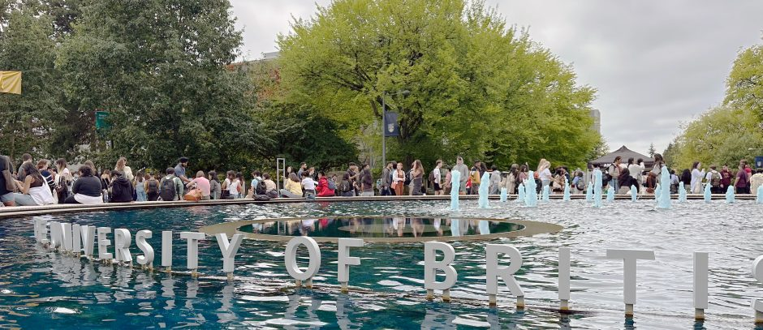

Orientation week was a bit of a whiplash after four years of undergrad. I came in from an Electrical and Computer Engineering background, having spent most of my final year buried in machine learning research rather than classes, so sitting in a room full of new classmates from economics, biology, and computer science backgrounds was a good reminder of how differently people think about the same data problems. The first few days were less about content and more about tooling: getting comfortable with the terminal, setting up Git and GitHub properly, and realizing how much of this program runs on version control and reproducibility rather than one-off scripts.

The first week of actual classes moved fast. What surprised me most was how much emphasis is placed on communication and workflow, things like commit hygiene, writing for a reader who isn't you, and publishing work publicly, rather than just the statistics and modeling I expected to be the focus. Coming from a research background where a lot of code lived in a single Colab notebook, having to think about project structure, `.gitignore`-style discipline, and a live website from week one has been a useful shift.

A few weeks in, I'm feeling good about the pace. It's demanding, but in a way that feels productive rather than just busy. I'm looking forward to seeing how the more technical courses build on this foundation, and to having a portfolio that actually reflects the work as I go, instead of scrambling to put one together at the end.

